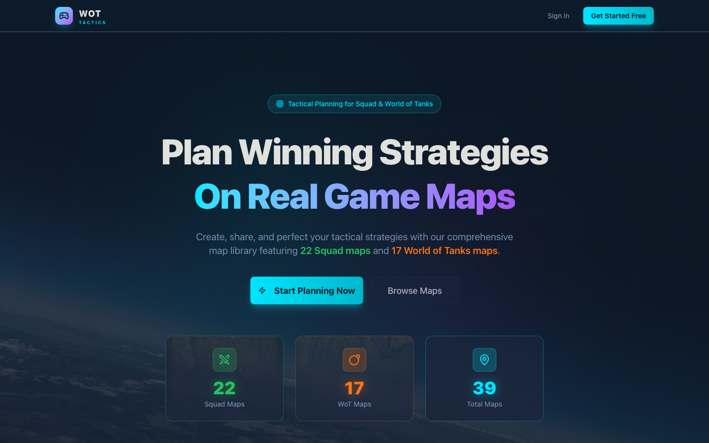
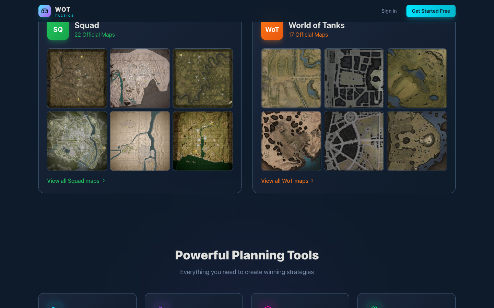
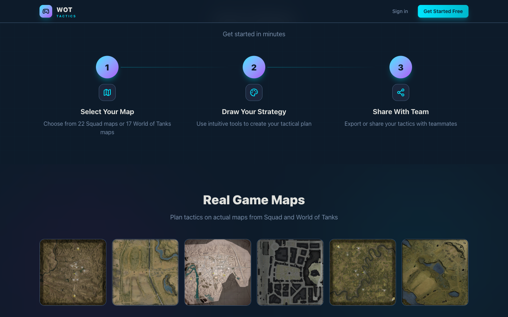
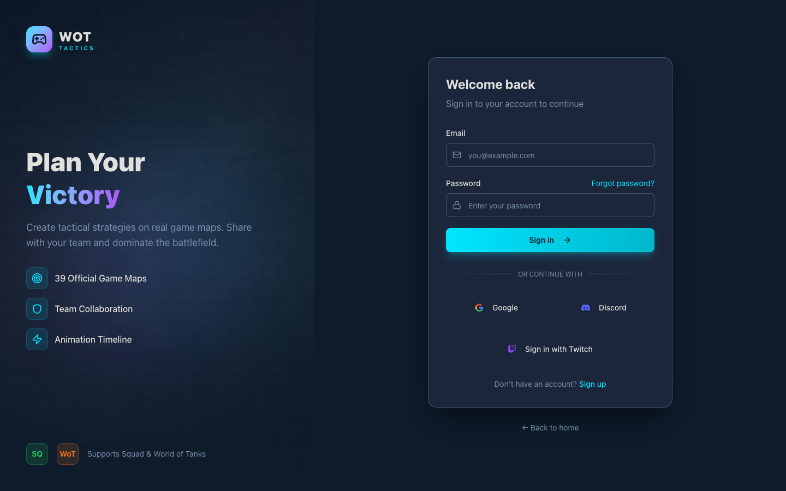

# WOT Tactics — Professional Esports Tactical Strategy Planner

> **Live:** [tactics-app-seven.vercel.app](https://tactics-app-seven.vercel.app) | **Status:** Frontend Complete (Backend paused) | **Source Code:** Private
>
> **Note:** This project was built as a SaaS product but development was paused before full backend deployment. The landing page, canvas editor, animation engine, and all frontend features are fully built. OAuth login (Google, Discord, Twitch) and Supabase backend integration are implemented in the source code but are not active on the live demo.

A production-grade SaaS tactical strategy planner for competitive gaming teams. Users draw animated tactical diagrams on real game maps (22 Squad maps + 17 World of Tanks maps), share strategies with teammates, and collaborate in real-time with live cursor synchronization.

---

## Live Product Screenshots

### Landing Page

The hero section showcasing the platform's core value proposition — plan winning strategies on real game maps with stats for 22 Squad maps, 17 WoT maps, and 39 total maps.

### Supported Games & Map Library

Side-by-side display of Squad and World of Tanks map libraries with real satellite/topographic game map images. Each map is playable in the tactics editor.

### How It Works & Map Gallery

Three-step workflow (Select Map → Draw Strategy → Share with Team) plus the real game maps gallery showing maps from both supported games.

### Authentication System

Custom split-screen login page with Google, Discord, and Twitch OAuth integration, supporting the gaming community's preferred auth providers. *OAuth providers and Supabase Auth are fully implemented in the codebase but not connected on the live preview — development was paused at this stage.*

---

## Core Features

### Canvas Editor (~1,800 lines)
- Built from scratch using Fabric.js 7
- Drawing tools: freehand, arrows, lines, shapes
- 60+ military/tactical SVG icons (infantry, vehicles, objectives)
- Layer management with per-layer visibility and locking
- Full undo/redo history
- Zoom, pan, and grid snapping

### Custom Animation Engine
- Keyframe-based animation system built from scratch
- 7 custom easing functions (linear, easeIn, easeOut, easeInOut, bounce, elastic, back)
- Per-object animation tracks with timeline phases
- Variable speed playback controls
- Animated GIF export via gifenc
- PDF export via jsPDF

### Real-Time Collaboration
- Live cursor synchronization via Supabase Realtime channels
- Operation broadcasting for collaborative editing
- "Follow Me" mode — viewers track the presenter's viewport
- Presence tracking with online/offline indicators
- Exponential backoff reconnection

### Multi-Workspace System
- Role-based access control (owner, admin, editor, viewer)
- 3-tier subscription model (Free, Pro, Max)
- Stored PostgreSQL functions for tier limit enforcement

---

## Tech Stack

| Layer | Technology |
|-------|-----------|
| Frontend | SvelteKit 2, Svelte 5 (runes/signals), TypeScript (strict), Tailwind CSS 4 |
| Canvas | Fabric.js 7 (~1,800 line editor) |
| Backend/DB | Supabase (PostgreSQL + Auth + Realtime + Row-Level Security) |
| Auth | Supabase Auth — Email/Password + Google + Discord + Twitch OAuth |
| Payments | iyzico (Turkish payment gateway) with HMAC-SHA256 webhook verification |
| Animation | Custom keyframe engine (7 easing functions) |
| Export | gifenc (animated GIF), jsPDF (PDF) |
| Deployment | Vercel |

---

## Key Metrics

| Metric | Value |
|--------|-------|
| Svelte Code | ~530 KB |
| TypeScript Code | ~308 KB |
| Source Files | 200+ |
| Canvas Editor | ~1,800 lines |
| Game Maps | 39 (22 Squad + 17 WoT) |
| Tactical SVG Icons | 60+ |
| SQL Migrations | 9 with RLS policies |
| Easing Functions | 7 (custom) |
| Subscription Tiers | 3 (Free, Pro, Max) |

---

## Key Technical Achievements

- Built a rich canvas editor from scratch (~1,800 lines) with drawing tools, 60+ icon placement, layers, undo/redo, zoom/pan
- Designed a custom keyframe animation engine with per-object tracks, timeline phases, and variable speed playback
- Implemented real-time collaboration with cursor sync, operation broadcasting, and "Follow Me" mode using Supabase Realtime
- Created 9 progressive SQL migrations with stored functions for tier limit enforcement and granular Row-Level Security policies
- Built multi-workspace system with role-based access control (owner, admin, editor, viewer)
- Integrated 3 OAuth providers (Google, Discord, Twitch) targeting the gaming community

---

## Built By

**Onur Haniffa** — Full-Stack Developer & ML Engineer
[Portfolio](https://onurhaniffa.com) · [LinkedIn](https://linkedin.com/in/onurhaniffa) · [GitHub](https://github.com/OnurHaniffa)
