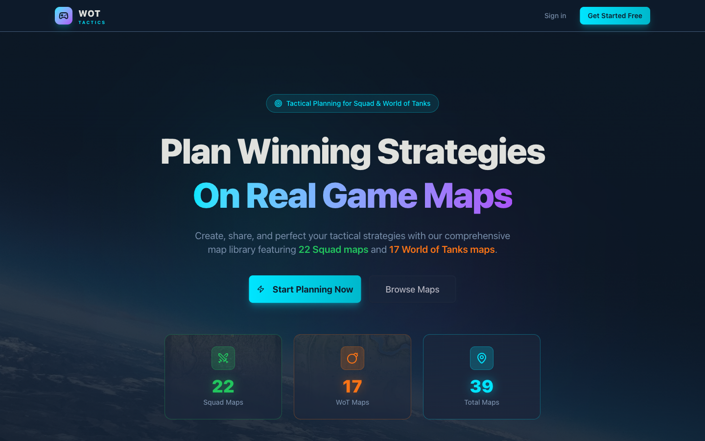

# WOT Tactics

> Professional-grade esports tactical strategy planner with real-time collaboration, animated playback, and a complete SaaS infrastructure.


> **Note:** This repository is a project showcase. The source code is maintained in a private repository.

---

## Overview

WOT Tactics is a production-grade SaaS application that allows competitive gaming teams to create animated tactical diagrams on real game maps, share strategies with teammates, and collaborate in real-time. The platform supports:

- **Squad** — 22 official maps
- **World of Tanks** — 17 official maps



---

## Architecture

```
┌──────────────────────────────────────────────────────────────────┐
│                         WOT TACTICS                               │
├──────────────┬──────────────┬───────────────┬────────────────────┤
│   Canvas     │  Animation   │  Real-time    │   SaaS Platform    │
│   Editor     │  Engine      │  Collab       │   Infrastructure   │
├──────────────┼──────────────┼───────────────┼────────────────────┤
│ Fabric.js 7  │ Custom       │ Supabase      │ Auth (Email+OAuth) │
│ Drawing      │ Keyframe     │ Realtime      │ Workspaces + RBAC  │
│ Tools        │ System       │ Channels      │ iyzico Payments    │
│ 60+ Icons    │ 7 Easing     │ Cursor Sync   │ Version History    │
│ Layers       │ Functions    │ Follow Mode   │ Comments + Chat    │
│ Undo/Redo    │ Timeline     │ Presence      │ Notifications      │
├──────────────┴──────────────┴───────────────┴────────────────────┤
│           SvelteKit 2 + Svelte 5 + TypeScript + Tailwind CSS 4   │
│           Supabase (PostgreSQL + Auth + Realtime + RLS)           │
└──────────────────────────────────────────────────────────────────┘
```

---

## Tech Stack

### Frontend
| Technology | Purpose |
|---|---|
| **SvelteKit 2** | Full-stack framework with SSR |
| **Svelte 5** | Latest runes/signals API (`$state`, `$derived`, `$effect`) |
| **TypeScript** | Strict typing throughout |
| **Tailwind CSS 4** | Utility-first styling with `tailwind-variants` |
| **Fabric.js 7** | 2D canvas manipulation for the tactical editor |
| **bits-ui** | Headless Svelte UI components |

### Backend & Database
| Technology | Purpose |
|---|---|
| **Supabase** | PostgreSQL database, Auth, Realtime, Storage |
| **9 SQL Migrations** | Progressive schema with RLS policies |
| **Row-Level Security** | Granular access control on every table |
| **Stored Functions** | Tier limit enforcement (`can_create_tactic`, `get_user_effective_tier`) |

### Payments & Infra
| Technology | Purpose |
|---|---|
| **iyzico** | Turkish payment gateway for subscriptions |
| **HMAC-SHA256** | Webhook signature verification |
| **gifenc** | Animated GIF export |
| **jsPDF** | PDF export |

---

## Key Features

### Rich Canvas Editor (~1,800 lines)
- Drawing tools: pencil, shapes (rectangles, circles), arrows, freehand
- Icon placement system with **60+ military/tactical SVG icons** (vehicles, kits, deployables, markers, objectives)
- Text annotations with background options
- Layer management (visibility, locking, opacity per layer)
- Undo/redo, zoom/pan, grid snap, smart guides
- Properties panel for selected objects

### Custom Keyframe Animation Engine
- From-scratch animation engine with 7 easing functions
- Per-object animation tracks with position, rotation, scale, and opacity keyframes
- Timeline phases (Setup, Execute, Post-plant)
- Playback controls with variable speed (0.25x to 2x), looping
- Object appear/disappear timing
- Animated GIF and PDF export

### Real-Time Collaboration
- Supabase Realtime channels with presence tracking
- Live cursor synchronization across users
- Canvas operation broadcasting (object add/modify/remove)
- "Follow Me" mode — leader locks all viewers to their viewport
- Anonymous collaboration via share links
- Collaborator avatars with generated names ("Swift Fox", "Shadow Eagle")
- Exponential backoff reconnection logic

### Workspace & Team Management
- Multi-workspace support with role-based access (owner, admin, editor, viewer)
- Personal workspace auto-created on signup
- Folder organization for tactics
- Favorites system and tagging

### Sharing & Version History
- Unique share codes with password protection
- Three permission levels: view, comment, edit
- Expiring links
- Snapshot-based versioning with restore capability

### Subscription System (3 Tiers)
| Feature | Free | Pro | Max |
|---|:---:|:---:|:---:|
| Tactics | 5 | 50 | Unlimited |
| Workspaces | 1 | 5 | Unlimited |
| Collaboration | 2 users | 10 users | 25 users |
| GIF Export | — | Yes | Yes |
| PDF Export | — | — | Yes |
| Animation | Basic | Advanced | Advanced |

---

## Database Design

**9 progressive migrations** building:
- Profiles, workspaces, folders, tactics
- Favorites, shares, version history
- Collaboration sessions, comments, chat
- Notifications, membership tiers
- Stored functions for tier limit enforcement
- Row-Level Security policies on every table

---

## Project Metrics

| Metric | Value |
|---|---|
| **Svelte Code** | ~530 KB |
| **TypeScript Code** | ~308 KB |
| **SQL Migrations** | ~44 KB (9 files) |
| **Source Files** | 200+ |
| **Game Maps** | 39 (22 Squad + 17 WoT) |
| **Tactical SVG Icons** | 60+ |
| **Canvas Editor** | ~1,800 lines |

---

## My Role

Solo developer — I designed the architecture, built the canvas editor, wrote the animation engine from scratch, implemented real-time collaboration, set up the payment system, and designed the entire database schema with security policies.

---

## Live Preview

The landing page is accessible at the deployed URL, showcasing the game map library and feature overview.

---

## Contact

**Onur Haniffa** — [onurhaniffa.com](https://onurhaniffa.com) · [LinkedIn](https://www.linkedin.com/in/onurhaniffa/)
